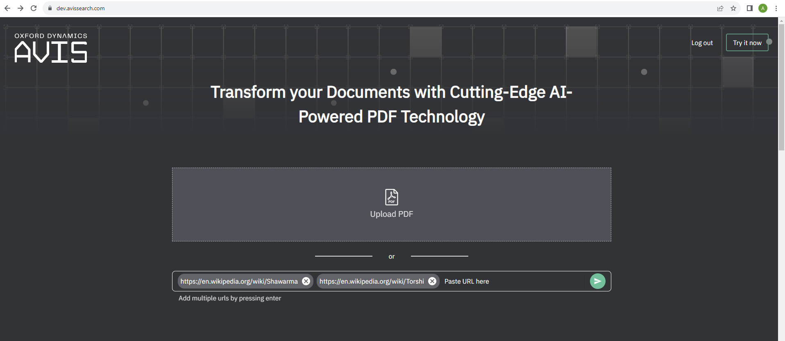
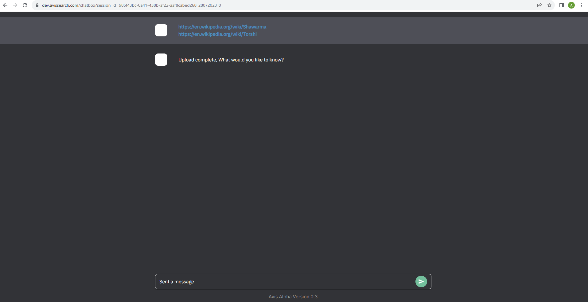

# How To Use AVIS

## Intro
AVIS (A Very Intelligent System) is a proprietary development by Oxford Dynamics Limited, UK.  AVIS is an intelligent search and interrogation system that utilises the power of AI and NLP.

The web interface, and underlying AVIS technology, is currently under development, so some bugs may be evident.  We would greatly appreciate it if you could let us know if you encounter any and we’ll do our best to address them as quickly as possible.  You can let us know via email to:  lets_talk@oxdynamics.com

We hope you enjoy AVIS’ power to unlock the information in your documents!

## Demo 🎥:

[avis demo video](https://vimeo.com/849512044/8dca7bab40?share=copy)

## Getting started 🚀:
### 1. Login
Click the login button in the top right corner, enter your email and agree to the terms and conditions. After clicking continue, a one-time password will be sent to your email (this may go to your junk email folder). Please enter this and hit sign in.

### 2. a) Files
   To upload PDFs, please click the Upload PDF box and select your document or documents from the explorer (maximum is set to 5). 
   
   
### 2. b) URLS
   To upload content based on website URLs, please paste the link to the website in the area shown. For multiple websites, please press enter after each website link (maximum is set to 5).

### 3. Chat
Once the files/URLs have loaded, you can ask questions in the ‘send a message’ box.

   👍 Questions can be specific to the documents/URLs (as shown in the below example) and AVIS will provide the answer with the reference from which source, where in the source, and how confident the response is.

### 4. a) Multiple PDFs
To select multiple documents, refer to step 2a and hold CTRL to click each document.

Loading may take several seconds, once loaded you can ask your question in the search bar.

### 4. b) Multiple URLs
To enter multiple URLs, refer to step 2b and press enter after each link.

Loading may take several seconds, once loaded you can ask your question in the search bar.

### 🗒️ Please note: 
The web application is currently in its early beta version release for a trial period, and as a result, it may exhibit some limitations. Here are the expected behaviors:

1. The interrogation works effectively when the user initiates the conversation with specific topic-related questions like "What are digital humans?" or "Are the digital humans personalizable?" In contrast, more general questions such as "What is written in the document I just uploaded?" may not yield optimal results.

2. However, once AVIS generates answers, subsequent questions can be broader and more general. For instance, users can inquire, "Can you explain that to me in simple terms?" or "Can you summarize that in one sentence?"

3. Non-UK users may experience a potential lag in data processing and response generation. This delay is attributed to the fact that the back-end servers of the web application are hosted in the UK.

Please keep in mind these limitations while using the web application during its trial period. Your feedback will be invaluable in improving its performance and enhancing the user experience.
